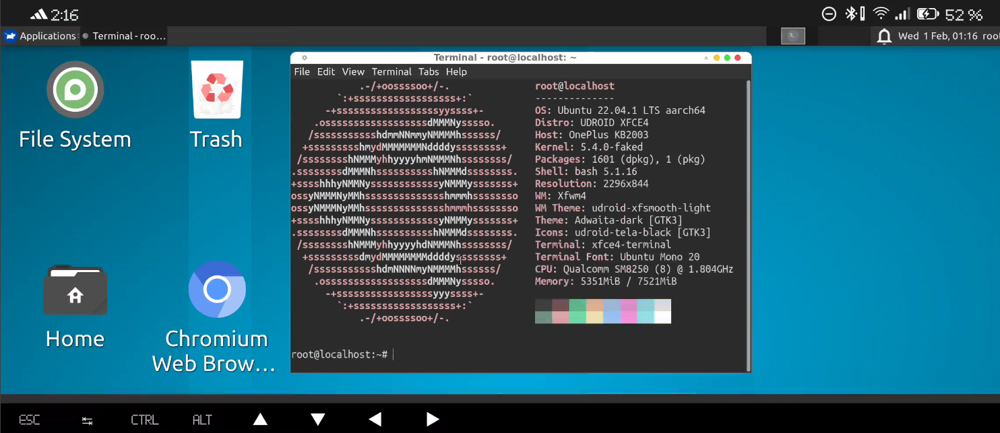

# Linux on Android



# Index
1. [Requirements](#id1)
2. [Tree directories](#id2)
3. [Packages to install](#id3)
4. [NO PROOT](#id4)
5. [PROOT](#id5)
6. [TOOLS](#id6)
7. [Links of interest](#id7)
8. [Acknowledgements](#id8)

## Requirements: <a name="id1"></a>
- Termux terminal app
- [Optional] termux api app (SSH server) [Script install]
- Server X11
    - termux:x11 [Script install]
- Fix error 9 or auto close termux: need **pc** and **adb install**, enable adb debug in your phone and execute this command in pc
``` ./adb shell "settings put global settings_enable_monitor_phantom_procs false" ```
- Update, upgrade and download repo on Termux: pkg update -y && pkg upgrade -y && pkg install -y git && git clone https://github.com/djmanri3/LOA-Linux-On-Android.git && cd LOA-Linux-On-Android/

## Tree directories <a name="id2"></a>
```
├── install_environment.sh
└── lib
    ├── proot_scripts
    │   ├── arch
    │   │   ├── install_cutefish_vnc_and_x11.sh
    │   │   ├── install_kde_vnc_and_x11.sh
    │   │   ├── install_lxqt_vnc_and_x11.sh
    │   │   └── install_xfce_vnc_and_x11.sh
    │   ├── debian
    │   │   ├── install_kde_vnc_and_x11.sh
    │   │   └── install_xfce_vnc_and_x11.sh
    │   ├── install_kde_vnc_and_x11.sh
    │   ├── install_proot.sh
    │   ├── proot_ui.sh
    │   ├── proot_ui_low.sh
    │   ├── raspberry_os
    │   │   └── install_lxde_vnc_and_x11.sh
    │   └── ubuntu
    │       ├── install_kde_vnc_and_x11.sh
    │       └── install_xfce_vnc_and_x11.sh
    ├── termux-x11
    │   ├── termux-x11-nightly-1.02.07-0-all.deb
    │   ├── termux-x11-nightly-1.03.00-0-all.deb
    │   └── termux-x11-universal.apk
    └── tools
        ├── connect_x11.sh
        ├── install_ssh_server.sh
        └── termux-api.apk
```

## Packages to install  <a name="id3"></a>
- X11-repo
- Pulseaudio
- Openssl
- xfce4*
- Firefox
- Chromium
- Termux-x11.deb (stable)

## NO PROOT  <a name="id4"></a>
### - Scripts:
- **install_environment.sh**: Install all packages of DE (Desktop Environment) and x11 utils

### - Advantages:
- Lighter: Only install Desktop Environment
- More optimal: Only run Desktop Environment

### - Disadvantages:
- Less package support: Limited to packages found in termux repos
- Less privileges: If our device is not rooted, we will not be able to perform commands with root

### - Install:
- [ ] Install Termux https://f-droid.org/repo/com.termux_118.apk
- [ ] Execute **install_environment.sh** with param **vanila**
```
./install_environment.sh vanila
```

### - Start environment:
- [ ] Execute command **x11vani**
- [ ] Or install termux:widget[https://f-droid.org/es/packages/com.termux.widget/] add wifdget on home screen, tap on x11vani

## PROOT  <a name="id5"></a>
### - Scripts:
- **install_environment.sh**: Install all packages of DE (Desktop Environment) and x11 utils
- **lib/proot_scripts/**: Install script with Desktop environments
- **lib/termux-x11/**: Packages of termux and apps
- **lib/tools/**: Tools for use

### - Advantages:
- Greater freedom: We have access to the sudo command (root)
- More packages: all packages for Ubuntu, Debian, Raspbian and Arch

### - Disadvantages:
- Heavier system: More background processes are needed to start the environment
- Takes up more space: This is because our device will contain all the necessary files of the chosen distro.

### - Install:

- [ ] Install Termux app https://f-droid.org/repo/com.termux_118.apk
- [ ] Execute **install_environment.sh** with param proot
```
./install_environment.sh proot
```
- [ ] Enter the number of the distro we want with which desktop environment

### - Start environment:
- [ ] Execute command **x11[Distro]**
    - **Ubuntu**: ubun
    - **Debian**: debi
    - **Raspbian**: pi
    - **Archlinux**: arch
- [ ] Or install termux:widget[https://f-droid.org/es/packages/com.termux.widget/] add wifdget on home screen, tap on x11[**Distro**]

## Tools  <a name="id6"></a>
### Server ssh
#### - Install:
- [ ] Install Termux https://f-droid.org/repo/com.termux_118.apk
- [ ] Execute **install_environment.sh** with param **ssh_server**
```
./install_environment.sh ssh_server
```

#### - Start SSH server:
- [ ] Execute command **sshd**

### Connect X11
#### - Install:
- [ ] Install Termux https://f-droid.org/repo/com.termux_118.apk
- [ ] Execute **install_environment.sh** with param **connect_x11 -s**
```
./install_environment.sh  connect_x11 -s
```

#### - Connect to X11 session:
- [ ] Execute command **./install_environment.sh  connect_x11** and follow the setup.

# Links of interest:  <a name="id7"></a>
- Proot-distro: https://github.com/termux/proot-distro
- Udroid: https://udroid-rc.gitbook.io/udroid-wiki/udroid-landing/readme
- Termux-x11: https://github.com/termux/termux-x11

# Acknowledgements:  <a name="id8"></a>
- Team Udroid
- YouTube chanel Tecnicalbot
- Team termux
